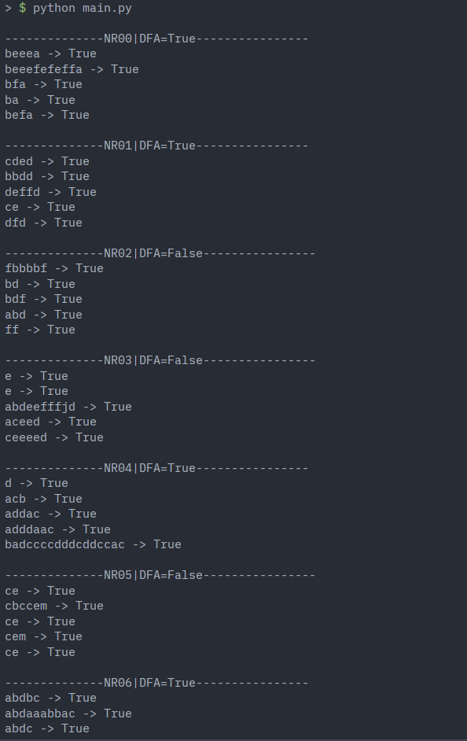

# Intro to formal languages. Regular grammars. Finite Automata.

### Course: Formal Languages & Finite Automata
### Author: Daniel Canter FAF-242

----

## Objectives:

* Implement a type/class for your grammar;

* Add one function that would generate 5 valid strings from the language expressed by your given grammar;

* Implement some functionality that would convert and object of type Grammar to one of type Finite Automaton;

* For the Finite Automaton, please add a method that checks if an input string can be obtained via the state transition from it;


## Implementation description

For fun i converted the variants.txt to a json using regex and made sure that 
the algorithm works for every variant. Because so grammars does not have direct
transition to a Deterministic Finite Automata i had to implement a system to calculate a Non-deterministic Finite Automata and make the system around it.
This works becase DFA is a subset of NFA.

To generate a string from the grammar i use the method **generate**:
```py
# At class Grammar:
def generate(self):
    s="S"
    while True:
        _b, s = self._next(s)
        if not _b:
            return s
```
This method starts with S token and goes next until reaches a terminal state.
To achive this it uses a private method **_next**:
```py
# At class Grammar:
def _next(self, s: str) -> tuple[bool, str]:
    for i, c in enumerate(s):
        if c in self.VN:
            return (True, self._changeTo(i ,s))
    else:
        return (False, s)
```
This method goes through the string and replaces non-terminal tokens to thier 
corresponding mappings defined in **P**.And returns a tuple with a boolean and a string which represent the final state and the current string respectively.

This is how we find a valid string from the grammar thats specified. Now for the next task we need to transform this into a FiniteAutomata.To achive this goal the method **toFiniteAutomation** is implemented as:
```py
# At class Grammar:
def toFiniteAutomation(self) -> FiniteAutomata:
    Q = self.VN + ["Vf"]
    SIGMA = self.VT
    DELTA: dict[str, dict[str, list[str]]] = {}
    F = ["Vf"]
    Q0 = "S"
    isDFA = True

    for fr, rule in self.P.items():
        if fr not in DELTA:
            DELTA[fr] = {}
        for st in self.P[fr]:
            if st[0] in DELTA[fr]:
                isDFA = False
            else:
                DELTA[fr][st[0]] = []
            if len(st) == 2:
                DELTA[fr][st[0]] += [st[1]]
            elif len(st) == 1:
                DELTA[fr][st[0]] += ["Vf"]

    return FiniteAutomata(Q, SIGMA, DELTA, Q0, F, isDFA)
```
This is a quite big method which basicly gets the *VN* and puts into *Q* (The states set). and we also add a final state called *Vf*. The sigma is the same as the VT the alphabet is not changed. And we also define the final state and the starting states. After this we parse the **P** and use the structural fact that the **P** -> [terminalToken,nonterminalToken|epsilon] with this we are pushing the delta functions into **DELTA** and if the the second token is epsilon we put the destination state as the final state.

The next task is to verify if a string belongs to the language. To do this we are using the only public method of FiniteAutomata **stringBelongToLanguage**:

```py
# At class FiniteAutomata:
def stringBelongToLanguage(self, s):
    for i, c in enumerate(s):
        self._next(c)
        if self._isFailed():
            break

    if self._isFinal():
        self._reset()
        return True

    self._reset()
    return False
```
This function runs the automata and checks if the string belongs to the language by steeping through the state machine (Finite Automata). For stepping through the machine we use the **_next** method:
```py
# At class FiniteAutomata:
def _next(self, c):
    newStates = self.STATES.copy()
    for ind, state in enumerate(self.STATES):
        if not (state in self.DELTA and c in self.DELTA[state]):
            del newStates[ind]
    self.STATES = newStates
    newStates = self.STATES.copy()
    for ind, state in enumerate(self.STATES):
        if state in self.DELTA and c in self.DELTA[state]:
            for i, path in enumerate(self.DELTA[state][c]):
                if len(newStates) > i:
                    newStates[ind] = self.DELTA[state][c][i]
                else:
                    newStates.append(self.DELTA[state][c][i])
        else:
            del newStates[ind]
    self.STATES = newStates
```
This method is maybe the most interesting method, it starts with going through the states and removes the final states and dead ends.This is important so the algorithm used depends on the indexes of STATES array without this inital loop the logic had to be forked instead we use a list of states STATES. After the fact in an another for loop we step through all states in respect with the delta functions assosiated to the current State. 

After going through all tokens in the string we verify if we had any final states. Only one state in the STATES list is enough. Finally we reset the automata to be used again by giving its inital state.

```py
for _ in range(5):
        words.append(grammar.generate())
for word in words:
    belongs = automata.stringBelongToLanguage(word)
    if not belongs:
        raise ValueError(f"Word '{word}' does not belong to the language.")
    print(f"{word} -> {belongs}")
```
At the entrypoint of the program we generate 5 string from the grammar and verify it through the automata converted from the grammar. For fun i do this for all of the variants and made sure that all of them passes reliably.

## Conclusions / Screenshots / Results

In this laboratory work I learned what is a Finite Automata, how to convert regular grammar to a Finita Automata and the difference between a Deterministic and Non-Deterministic Finite Automata. The main idea of a state machine (Finite Automata) to be verifying that the string is in the langauge of the Finite Automata.

Program Output:



The output is the series of variants and their generated string according to the specified grammars.

## References
The sources consulted before writing the code.
- [MIT video Introduction to Finite Automata](https://www.youtube.com/watch?v=9syvZr-9xwk)
- [The indian guy](https://www.youtube.com/watch?v=pATp66LPwYw)