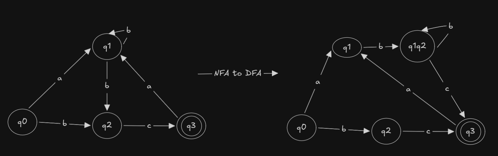

# Determinism in Finite Automata. Conversion from NDFA 2 DFA. Chomsky Hierarchy.

### Course: Formal Languages & Finite Automata
### Author: Daniel Canter FAF-242

----
### Disclaimer: The code indentation is not always consistent. Sorry

## Objectives:

1. Continuing the work in the same repository and the same project, the following need to be added:
    a. Provide a function in your grammar type/class that could classify the grammar based on Chomsky hierarchy.

    b. For this you can use the variant from the previous lab.

2. According to your variant number (by universal convention it is register ID), get the finite automaton definition and do the following tasks:

    a. Implement conversion of a finite automaton to a regular grammar.

    b. Determine whether your FA is deterministic or non-deterministic.

    c. Implement some functionality that would convert an NDFA to a DFA.
    
    d. Represent the finite automaton graphically (Optional, and can be considered as a __*bonus point*__):
      
    - You can use external libraries, tools or APIs to generate the figures/diagrams.
        
    - Your program needs to gather and send the data about the automaton and the lib/tool/API return the visual representation.

## Implementation description

For fun i converted the variants.txt to a json using regex and made sure that 
the algorithm works for every variant. 

The program consist of 3 main classes Grammar, NFA, DFA different from the previous
lab task i had to seperate these two from the last lab work i preserved and developed the *_next* method of the NFA to be able to compute the new variants.
The last variant couldnt compute some variants thats now fixed. In general i have changed the strategy of the *_next* method.

```py
def _next(self, token):
    next_possible_states = set()
    for state in self.STATES:
        if state in self.DELTA and token in self.DELTA[state]:
            for target in self.DELTA[state][token]:
                next_possible_states.add(target)
  
  self.STATES = list(next_possible_states)
```

In this variation of the method the working principle is much simpler and 
the main improvement is to remove the last states compleatly while starting the compute and to make that simpler a list was substited with a set.

One of the task was to identify if a automatan is a DFA or not. I did not wanted to go full on OOP approach which is possible i wanted to implement it in different classes and because a DFA is a subset of an NFA it was logic to to implement a *isDFA* method inside NFA

```py
def isDFA(self) -> bool:
    for state, transitions in self.DELTA.items():
        if not all(len(v) == 1 for v in transitions.values()):
            return False
    return True
```

This method all its doing is to check if a delta transition has more than 1 arrival state if it has it is not a DFA and thus returns False

One other task was to implement a transition back to grammar

```py
def toGrammar(self) -> Grammar:
  VT = self.SIGMA
  q = self.Q[:]
  VN = q
  P = {}
  for state, transitions in self.DELTA.items():
    for c, next_states in transitions.items():
      for next_state in next_states:
        next_state = next_state if next_state not in self.F else ""
        transition = f"{c}{next_state}"
        if state not in P:
          P[state] = []
        P[state].append(transition)
    return Grammar(VN, VT, P, Start=self.Q0)
```

This method is the doing the reverse of the toGrammar method it puts back the grammar and there was a small upgrade to grammar generation function because now we need to support multiple character tokens when generating the grammar.

```py
def _tokens(self, s: str) -> list[tuple[int, str]]:
  start = 0
  end = 1
  tokens = []
  while end <= len(s):
    if s[start:end] in self.VN or s[start:end] in self.VT:
      tokens.append((start, s[start:end]))
      start = end
    end += 1
```

The upgrade is practically is to just scanning for multiple tokens instead of picking the next character.

Also a new addition to the grammar was to add type method which is another task in the list to implement. I chose to not put the source code into the report because its too long but the main idea is to go through to all rules for the types and then returning the relevant type.

Now maybe the most interesting part is the transtion between a NFA and a DFA. This is one of the longest pieces of code in the file.

```py
def toDFA(self) -> DFA:
    # Use a sorted list to ensure the key is always identical for the same set
    start_set = frozenset([self.Q0])
    start_name = str(sorted(list(start_set)))
    
    dfa_delta = {}
    states_to_process = [start_set]
    dfa_states = {start_set}
    final_states = set()
    
    while states_to_process:
        current_set = states_to_process.pop()
        current_name = str(sorted(list(current_set)))
        
        # Check if this set contains any NFA final states
        if any(s in self.F for s in current_set):
            final_states.add(current_name)
            
        dfa_delta[current_name] = {}
        
        for char in self.SIGMA:
            next_set = set()
            for nfa_state in current_set:
                if nfa_state in self.DELTA and char in self.DELTA[nfa_state]:
                    next_set.update(self.DELTA[nfa_state][char])
            
            if not next_set:
                continue
                
            next_frozenset = frozenset(next_set)
            next_name = str(sorted(list(next_frozenset)))
            dfa_delta[current_name][char] = next_name
            
            if next_frozenset not in dfa_states:
                dfa_states.add(next_frozenset)
                states_to_process.append(next_frozenset)
  
    all_dfa_state_names = [str(sorted(list(s))) for s in dfa_states]
    return DFA(all_dfa_state_names, self.SIGMA, dfa_delta, start_name, list(final_states))
```

So mathematically for this transition to happen we need to have a transition to a singular state.
In order to achieve this we transition to a new state which is actually the both states together and these states point to the same states as the parent states except the parent states. With this we can look at this code piece. To represent the states we use a string but when we want to represent a transitiion two multiple sets at the same time we actually want to preserve the elements so we can iterate through that for this reason we can use a little trick called a frozenset this trick is nessesary to use the sets as an index for a hashMap because hashing a mutable object wont give a consistent results so python does not allow this kind of hashing for its maps. But a frozen set is immutable so it can verry well can be hashed no problem. 

Okay this much introduction is enough. We start by proccessing the states with appending all Q's to 'states to process' and until we process all of our states at hand we might find new states which are the unified states which we represent through frozen states. And after we iterate through them all we obtain a DFA and then we return a DFA.

### Main

In the main we read all the variants.
To test and demo the type feature of the grammar we init 4 different kind of grammars and we print the type of it since all of the grammars from a FA will always result in a Regular Grammar. 

For each variant we get a grammar and to controll if everything works fine i chose to iterate 1000 times with a new word genereated from this grammar and check if the dfa and nfa can both identify this word if everythings goes right because we generate the grammar from the nfa we should be able to identify the word in both cases.

Lastly with the help of the graphviz we can generate the graph of each varian in the folder graph with the name their indecies. You can disable this behaiviour by setting the constant *GENERATE_GRAPHS* to False if you dont want to install the library or you dont want generate the graphs.

## Variant 10

This is the variant that was assigned the graph convertion:




## Conclusion

Whith this lab can be learned that regular grammar, nfa and dfa has a mapping between themselves and this can be used to identify the words that belong to the language.

